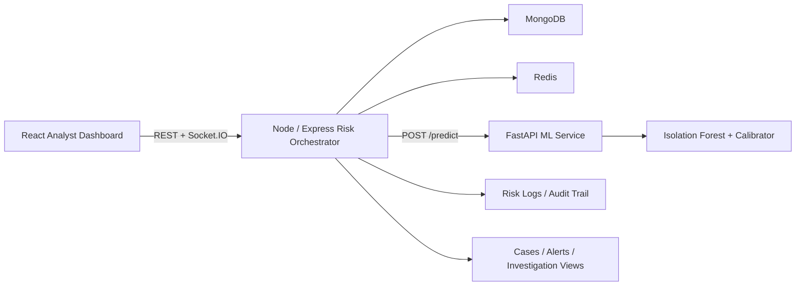

# Real-Time Fraud Detection & Risk Scoring System

A production-style fintech fraud operations platform built with React, Node.js, MongoDB, Redis, and a Python ML microservice. It simulates UPI-like transactions, scores risk in real time, explains why a transaction was flagged, and gives fraud analysts a working internal dashboard for alerts, cases, audit review, and user investigation.

## What This Project Is

This is not a basic CRUD banking demo. The platform is designed to feel like an internal fraud operations product used by analysts.

It includes:

- a live operations dashboard for fraud monitoring
- a transaction scoring pipeline with ML and rule-based risk evaluation
- an investigation workflow with cases and analyst notes
- an audit trail for explainability and compliance review
- user risk profiling and connected-account analysis
- resilience features such as Redis fallback and ML degradation handling

## Main Capabilities

### 1. Real-time Fraud Detection

Every incoming or simulated transaction is processed through a hybrid risk engine:

- behavioral features are computed from recent user activity
- the backend calls the Python ML service for a fraud probability
- deterministic fraud rules are applied
- both signals are combined into a final risk score from 0 to 100
- the transaction is classified as:
  - `SAFE`
  - `SUSPICIOUS`
  - `FRAUD`

### 2. Fraud Operations Dashboard

The frontend provides analyst-facing views for:

- Dashboard
  - platform metrics
  - risk trend
  - alert queue
  - live transaction feed
  - system health
- Cases
  - investigation queue
  - status changes
  - ownership assignment
  - analyst notes
  - resolution tracking
- Transactions
  - newest-first live transaction feed
  - click-to-open explainability panel
- Alerts
  - prioritized fraud alerts
  - severity-aware operational queue
- Analytics
  - user behavior risk view
  - connected-account relationships
- Audit Trail
  - full decision history
  - rule triggers
  - top factors
  - fallback visibility

### 3. Explainable AI

When analysts open a scored transaction, they can inspect:

- ML score
- rule triggers
- top contributing behavioral factors
- baseline vs observed feature comparisons

This answers the core fraud analyst question:

`Why was this transaction flagged?`

### 4. Case Management

Flagged transactions are turned into analyst cases with:

- `OPEN`
- `UNDER_REVIEW`
- `RESOLVED`
- `FALSE_POSITIVE`

Cases support:

- assignee selection
- comment/note history
- resolution reason

### 5. User Investigation Workflow

The platform supports deeper investigation through:

- recent transaction history
- device history
- location history
- average amount profile
- user risk ranking
- connected sender-receiver relationship tracking

### 6. Operational Resilience

The backend is built to degrade gracefully:

- if Redis is unavailable, it falls back to in-memory caching
- if the ML service fails or times out, scoring continues with rule-based fallback
- degraded scoring decisions are visible in the audit trail

## Architecture



Detailed notes: [docs/architecture.md](C:\Users\prajj\Documents\New project\docs\architecture.md)

## Repository Layout

The repository root now directly contains the application folders:

```text
client/
server/
ml-service/
docker/
docs/
README.md
```

## Tech Stack

### Frontend

- React
- Vite
- Tailwind CSS
- Recharts
- Socket.IO client

### Backend

- Node.js
- Express
- Mongoose
- JWT auth
- Socket.IO
- Redis via `ioredis`
- Winston logging

### ML Service

- Python
- FastAPI
- scikit-learn
- imbalanced-learn
- pandas / numpy

### Data Stores

- MongoDB
- Redis

## Core System Flow

1. A transaction is submitted manually or through the simulation engine.
2. The backend validates sender and receiver.
3. Behavioral features are built from recent history:
   - average amount deviation
   - hourly velocity
   - daily velocity
   - device mismatch
   - location deviation
4. The backend calls the ML service.
5. The ML output is combined with fraud rules.
6. A final risk score and decision are generated.
7. The system writes:
   - transaction record
   - risk log
   - device session update
   - case, when applicable
8. Socket events update the dashboard in real time.

## Data Model

### `users`

- identity
- auth credentials
- baseline profile
- default location / device preferences

### `transactions`

- sender / receiver
- amount
- device data
- location
- ML score
- rule signals
- priority
- decision
- final risk

### `risk_logs`

- full scoring breakdown
- latency
- top factors
- triggered rules
- fallback mode
- audit explanation

### `device_sessions`

- trusted / recent device state
- last seen location
- session timing

### `cases`

- linked transaction
- status
- assigned analyst
- notes
- resolution reason

### `ops_events`

- operational degradation events
- suspicious login / security activity

## API Overview

More detail: [docs/api.md](C:\Users\prajj\Documents\New project\docs\api.md)

### Auth

- `POST /api/auth/register`
- `POST /api/auth/login`
- `GET /api/auth/me`

### Transactions

- `POST /api/transactions/simulate`
- `GET /api/transactions/recent`

### Dashboard / Analyst APIs

- `GET /api/dashboard/overview`
- `GET /api/dashboard/alerts`
- `GET /api/dashboard/cases`
- `PATCH /api/dashboard/cases/:caseId`
- `GET /api/dashboard/transactions/:transactionId`
- `GET /api/dashboard/users/:userId/profile`
- `GET /api/dashboard/audit-trail`
- `GET /api/dashboard/system-status`
- `GET /api/dashboard/graph-insights`

### ML Service

- `GET /health`
- `POST /predict`
- `POST /train`

## Environment Setup

Create these files from the examples:

- [server/.env.example](C:\Users\prajj\Documents\New project\server\.env.example) -> `server/.env`
- [client/.env.example](C:\Users\prajj\Documents\New project\client\.env.example) -> `client/.env`
- [ml-service/.env.example](C:\Users\prajj\Documents\New project\ml-service\.env.example) -> `ml-service/.env`

Typical values:

### `server/.env`

```env
PORT=5000
MONGO_URI=mongodb://localhost:27017/fraud_detection_system
JWT_SECRET=replace-with-a-strong-secret
ML_SERVICE_URL=http://localhost:8001
REDIS_URL=redis://localhost:6379
CLIENT_URL=http://localhost:5173
```

### `client/.env`

```env
VITE_API_URL=http://localhost:5000/api
VITE_SOCKET_URL=http://localhost:5000
```

### `ml-service/.env`

```env
MODEL_PATH=models/fraud_model.joblib
METRICS_PATH=models/model_metrics.json
DATA_PATH=data/sample_transactions.csv
```

## How To Run The Project

Use four terminals.

### 1. Start MongoDB and Redis

```bash
cd "/c/Users/prajj/Documents/New project/docker"
docker compose up mongo redis
```

### 2. Start the ML service

```bash
cd "/c/Users/prajj/Documents/New project/ml-service"
./.venv/Scripts/python.exe -m uvicorn app.main:app --reload --port 8001
```

If `.venv` does not exist:

```bash
cd "/c/Users/prajj/Documents/New project/ml-service"
python -m venv .venv
./.venv/Scripts/python.exe -m pip install -r requirements.txt
./.venv/Scripts/python.exe -m uvicorn app.main:app --reload --port 8001
```

### 3. Start the backend

```bash
cd "/c/Users/prajj/Documents/New project/server"
npm run dev
```

### 4. Start the frontend

```bash
cd "/c/Users/prajj/Documents/New project/client"
npm run dev
```

### 5. Open the app

```text
http://localhost:5173
```

## Demo Credentials

Seeded by the backend on first boot:

- Admin: `admin@finsecure.ai` / `Admin@123`
- Demo user: `user1@finsecure.ai` / `User@123`

## How To Test The App

### Scenario 1: Normal Payment

Use low amount, no location jump, no device change.

Expected:

- transaction appears in the live feed
- decision is usually `SAFE`
- few or no alerts
- low risk score

### Scenario 2: Fraud Attack

Use high amount, large location jump, and device change.

Expected:

- decision becomes `SUSPICIOUS` or `FRAUD`
- high risk score
- alert queue grows
- audit trail shows strong factors and rule triggers
- case may be created

### Scenario 3: Burst Attack

Use multiple transactions in burst simulation.

Expected:

- many new transactions appear at the top of the feed
- repeated alerts appear
- connected accounts update
- risk and priority remain elevated

### Scenario 4: Manual Investigation

Submit a custom transaction from the manual tab.

Expected:

- transaction appears immediately
- clicking it opens the explainability side panel
- user analytics and graph insights update over time

## Reliability Notes

- Redis is optional at runtime
- ML can fail without stopping transaction processing
- fallback events are visible to analysts
- all risk decisions are logged for audit review

## Verification Notes

The project has been verified locally with:

- frontend production build
- backend syntax checks
- ML service compile check

## Future Improvements

- route-based frontend navigation instead of view switching
- alert grouping and deduplication
- deeper graph analysis
- chunk splitting for a smaller frontend bundle
- richer user profile trend charts

## Screenshots

You can add screenshots to [docs](C:\Users\prajj\Documents\New project\docs) and link them here later once you capture final UI shots.
