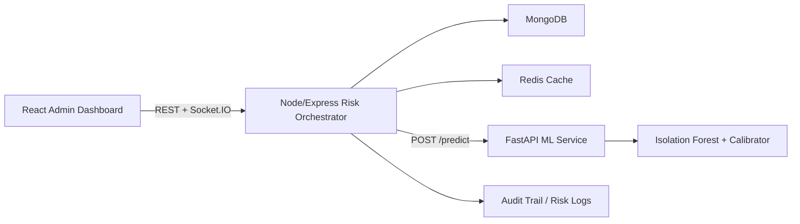

# Real-Time Fraud Detection & Risk Scoring System

A production-style MERN + AI fintech platform that simulates UPI-like payments, evaluates transaction risk in real time, and streams fraud alerts to an admin dashboard.

## What is included

- React + Tailwind admin dashboard with live transaction feed, risk trend charts, alert center, and behavior analytics
- Node.js + Express orchestration service with JWT auth, WebSocket updates, Redis-backed recent activity cache, and MongoDB persistence
- Python FastAPI microservice exposing `/predict` for fraud scoring using an Isolation Forest-based anomaly pipeline with SMOTE-backed probability calibration
- Docker setup for client, server, ML service, MongoDB, and Redis
- Synthetic training data, evaluation script, and architecture docs

## Architecture



More detail: [docs/architecture.md](./docs/architecture.md)

## Repository layout

```text
fraud-detection-system/
  client/
  server/
  ml-service/
  docker/
  docs/
```

## Local setup

### 1. Configure environment files

Copy these templates and adjust as needed:

- `server/.env.example` -> `server/.env`
- `client/.env.example` -> `client/.env`
- `ml-service/.env.example` -> `ml-service/.env`

### 2. Start the ML service

```bash
cd ml-service
python -m venv .venv
. .venv/Scripts/activate
pip install -r requirements.txt
uvicorn app.main:app --reload --port 8001
```

### 3. Start the backend

```bash
cd server
npm install
npm run dev
```

### 4. Start the frontend

```bash
cd client
npm install
npm run dev
```

## Docker setup

```bash
cd docker
docker compose up --build
```

## Demo credentials

- Admin: `admin@finsecure.ai` / `Admin@123`
- Demo user: `user1@finsecure.ai` / `User@123`

These are seeded automatically by the Node service when the database is empty.

## Core workflows

### Simulate a transaction

`POST /api/transactions/simulate`

Payload example:

```json
{
  "senderId": "mongo-user-id",
  "receiverId": "mongo-user-id",
  "amount": 19500,
  "deviceId": "device-iphone-14",
  "location": {
    "city": "Mumbai",
    "lat": 19.076,
    "lng": 72.8777
  },
  "mode": "fraud"
}
```

### Prediction response from ML service

```json
{
  "fraud_probability": 0.82,
  "anomaly_score": 0.91,
  "top_factors": ["device_mismatch", "location_deviation_km", "velocity_1h"]
}
```

## Evaluation goals

- Optimize for recall on highly imbalanced fraud events
- Track precision, recall, and F1 score
- Keep prediction latency under 200ms by loading the model in memory and avoiding per-request retraining

## Screenshots

Add screenshots to `docs/` and link them here once the UI is running in your environment.

## Notes

- Redis is optional at runtime; the backend falls back to in-memory caching if Redis is unavailable
- The ML service auto-trains a model artifact on first boot if one is not present
- Every risk decision is logged to `risk_logs` for auditability
